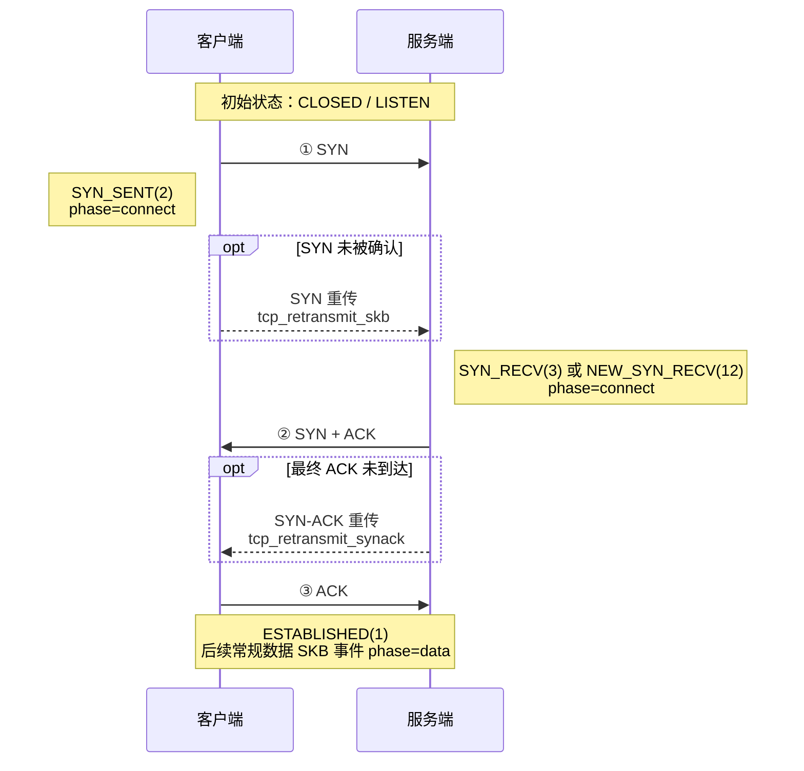

## 概述

`tcpretrans` 通过内核跟踪点 `tcp/tcp_retransmit_skb` 和
`tcp/tcp_retransmit_synack` 观测 TCP 重传相关活动。根据事件类型，每条事件可携带
IP 四元组、TCP 状态、拥塞控制状态、重传计数器、序列号信息，以及用于解析容器
归属的 socket 元数据。

用户态分类器根据事件类型、`sk_state`、`ca_state` 和乱序计数器生成连接阶段与
原因标签。这些标签是用于运维分析的启发式分类，不是丢包根因的确定性证据。

过滤表达式由 `internal/pcapfilter` 在加载时编译并在内核中执行。过滤器只对
携带 SKB 的 `tcp_retransmit_skb` 事件生效；SYN-ACK 事件会绕过 pcap 过滤器。

---

## 1. 过滤表达式

### 1.1 支持的表达式

`internal/pcapfilter` 使用纯 Go 的 go-pcap 编译器，支持 tcpdump 语法的一个
子集。以下表达式适用于 tcpretrans：

**主机地址**

```
host 10.0.0.1
src host 10.0.0.1
dst host 10.0.0.1
```

**端口**

```
port 443
src port 443
dst port 8080
```

**网段（CIDR）**

```
net 10.0.0.0/8
src net 192.168.1.0/24
dst net 172.16.0.0/12
```

**布尔运算与分组**

```
tcp and port 443
host 10.0.0.1 and (port 80 or port 443)
tcp and not net 169.254.0.0/16
```

所有重传 SKB 都是 TCP 报文，因此 `tcp` 原语并非必需，但加上后表达式通常更
容易理解。

### 1.2 限制

| 表达式或事件 | 行为 |
|--------------|------|
| `tcp[tcpflags]`、`ip[8]`、`tcp[0:4]` | 当前编译器不支持字节偏移表达式。 |
| 单独使用 `ip` 或 `ip6` | 在 L3 视角中不要依赖它们区分地址族；应使用 `host`、`net` 或更明确的 TCP 表达式。 |
| `arp`、`ether host ...` 等仅适用于 L2 的表达式 | 对 TCP 重传 SKB 没有意义，并可能拒绝所有 L3 事件或产生未定义的 L3 匹配。 |
| `tcp_retransmit_synack` | BPF 程序无法取得 SKB，因此不执行 `--filter`。 |

完整语法和限制以 `internal/pcapfilter` 的实现为准。上述事件覆盖范围限制是
tcpretrans 特有的。

### 1.3 推荐写法示例

```bash
# 目标端口为 443 的常规重传 SKB
--filter "dst port 443"

# 指定主机任意方向的常规重传 SKB
--filter "host 10.0.0.1"

# 指定服务网段的常规重传 SKB
--filter "dst net 10.20.0.0/16 and dst port 8443"

# 从常规重传 SKB 事件中排除噪声端点
--filter "tcp and not host 169.254.169.254"
```

> `--filter` 不能保证整个输出流都满足表达式：
> `tcp_retransmit_synack` 事件仍会输出。如果独立工具的 JSON 输出需要过滤全部
> 事件类型，应使用 `jq` 按格式化后的地址和端口字段过滤。

---

## 2. 运行 tcpretrans

```
tcpretrans [flags]
```

| 参数 | 默认值 | 说明 |
|------|--------|------|
| `--bpf-path <path>` | 必填 | `tcp_retrans.o` eBPF 对象文件路径。 |
| `--filter <expr>` | （无） | 仅用于 `tcp_retransmit_skb` 事件的 tcpdump 风格过滤器，见 §1。 |
| `--duration <n>` | 0 | 运行 N 秒后退出（0 表示持续运行直至 Ctrl-C）。 |
| `--output <json\|text>` | `text` | 输出格式；设置 `--output-storage` 时会被忽略。 |
| `--output-storage <path>` | （无） | 通过 Unix socket 将事件发送给 huatuo-bamai。 |
| `--task-id <id>` | （无） | toolstream 会话关联的任务 ID；与 `--output-storage` 一起使用时生效。 |

显式同时指定 `--output` 和 `--output-storage` 时，`--output` 会被忽略并打印
警告。

### 常用命令

```bash
# 文本格式输出全部重传相关事件
sudo tcpretrans --bpf-path bpf/tcp_retrans.o

# NDJSON 格式输出
sudo tcpretrans --bpf-path bpf/tcp_retrans.o --output json

# 在 BPF 侧过滤目标端口为 443 的常规重传 SKB
sudo tcpretrans --bpf-path bpf/tcp_retrans.o --filter "dst port 443"

# 在用户态过滤全部格式化事件类型，只保留目标端口 443
sudo tcpretrans --bpf-path bpf/tcp_retrans.o --output json \
  | jq -c 'select(.dport == 443)'

# 运行 60 秒，仅保留分类为 RTO 的事件
sudo tcpretrans --bpf-path bpf/tcp_retrans.o --duration 60 --output json \
  | jq -c 'select(.reason == "RTO")'

# 将事件转发给正在运行的 huatuo-bamai 实例
sudo tcpretrans --bpf-path bpf/tcp_retrans.o \
  --output-storage /var/run/huatuo-toolstream.sock
```

`jq -c` 将每条结果压缩成单行 JSON，便于保存为 NDJSON 或继续通过管道处理。

---

## 3. 事件数据结构

每条事件以 NDJSON 对象（`types.TCPRetransTracing`）表示。带 `omitempty`
标签的字段在值为空或零时不会输出。

| 字段 | 类型 | 说明 |
|------|------|------|
| `observed_timestamp` | string | 用户态接收/格式化事件时生成的 UTC 时间（RFC3339Nano），不是内核 hook 时间。 |
| `comm` | string | 当前内核执行上下文的进程名，不一定是 socket 所属进程。 |
| `pid` | uint64 | 当前执行上下文的 TGID，不一定是 socket 所属进程的 TGID。 |
| `container_id` | string | huatuo-bamai 解析出的容器 ID，见 §6。 |
| `memcg_css` | uint64 | 用于解析容器归属的 socket 内存 cgroup CSS 地址。 |
| `net_namespace_cookie` | uint64 | 用于解析容器归属的 socket 网络命名空间 cookie。 |
| `net_namespace_inode` | uint32 | 用于解析容器归属的 socket 网络命名空间 inode。 |
| `saddr` | string | 源 IP 地址。 |
| `daddr` | string | 目的 IP 地址。 |
| `sport` | uint16 | 源端口。 |
| `dport` | uint16 | 目的端口。 |
| `family` | uint16 | 地址族（`2` = AF_INET，`10` = AF_INET6）。 |
| `tcp_state` | string | TCP socket 状态，如 `ESTABLISHED`、`SYN_SENT` 或 `NEW_SYN_RECV`。 |
| `phase` | string | 分类结果：`connect`、`data` 或 `close`。 |
| `reason` | string | 分类结果：`RTO`、`fast_retransmit`、`reorder_prone_fast` 或 `unknown`。 |
| `event_type` | string | `tcp_retransmit_skb` 或 `tcp_retransmit_synack`。 |
| `ca_state` | uint8 | 拥塞控制状态：0=Open、1=Disorder、2=CWR、3=Recovery、4=Loss。 |
| `icsk_retransmits` | uint8 | 当前重传计数器快照。 |
| `icsk_pending` | uint8 | `inet_connection_sock` 中原始的待处理定时器状态。 |
| `reord_seen` | uint32 | 连接累计乱序计数器。 |
| `dsack_dups` | uint32 | 累计 DSACK 重复计数器。 |
| `tcp_seq` | uint32 | SKB 事件中 `TCP_SKB_CB(skb)->seq`，即重传段起始序列号；SYN-ACK 事件中为零。 |
| `tcp_ack` | uint32 | SKB 事件中 `tcp_sk(sk)->rcv_nxt`，即实际重传包 TCP 头会携带的 ACK 序号；SYN-ACK 事件中为零。 |
| `tcp_end_seq` | uint32 | SKB 事件中 `TCP_SKB_CB(skb)->end_seq`，即重传段结束序列号；SYN-ACK 事件中省略。 |
| `tcp_flags` | string | 渲染后的 TCP flag 集合，如 `SYN|ACK`、`ACK|PSH`；SKB 事件来自 `TCP_SKB_CB(skb)->tcp_flags`，SYN-ACK 事件由事件类型派生。 |
| `tcp_flags_raw` | uint8 | TCP flag 原始位图；SKB 事件来自 `TCP_SKB_CB(skb)->tcp_flags`，SYN-ACK 事件为 `SYN|ACK` 对应的位图。 |
| `skb_addr` | string | 十六进制重传队列 SKB 指针；SYN-ACK 事件中不存在。 |
| `drop_location` | string | huatuo-bamai 生成的丢包关联启发式结果，见 §7。 |
| `source` | string | 可选来源字段；独立 CLI 当前不设置该字段。 |

### 文本输出格式

```
<timestamp> [<phase>/<reason>] <saddr>:<sport> > <daddr>:<dport> state=<STATE> [SYNACK] [skb=<addr>] [seq=<N> [end=<N>] ack=<N>] [flags=<FLAGS>] pid=<N>[<comm>] ca=<N> retrans=<N>
```

示例：

```
2026-07-08T09:19:52.042Z [data/RTO] 10.0.0.1:443 > 10.0.0.2:58244 state=ESTABLISHED skb=0xffff888012345678 seq=123456 end=124916 ack=789012 flags=ACK pid=0[swapper/0] ca=4 retrans=3
```

示例中的 `pid` 和 `comm` 表示 hook 运行时的执行上下文；工作负载归属应使用
`container_id` 和 socket 元数据判断。

---

## 4. 内核事件与分类

### 4.1 内核挂载点

| 挂载点 | 内核位置 | 事件含义 | 可用数据 |
|--------|----------|----------|----------|
| tracepoint `tcp/tcp_retransmit_skb` | `__tcp_retransmit_skb()` | 对一个重传队列 SKB 发起了重传尝试；tcpretrans 事件不保留内核发送结果。该 SKB 是 headerless 的，因此序列号来自 `TCP_SKB_CB(skb)`，ACK 来自 `tcp_sk(sk)->rcv_nxt`。 | SKB 指针、TCP seq/end_seq/ack/flags、socket 状态、CA 状态、定时器和乱序计数器。 |
| tracepoint `tcp/tcp_retransmit_synack` | `tcp_rtx_synack()` | `tcp_rtx_synack()` 成功提交了一次被动建连 SYN-ACK 重传。 | request socket 地址和端口；没有重传 SKB 指针及 TCP seq/ack。 |

BPF 程序通过 `BPF_CORE_READ` 等辅助方法执行 CO-RE 字段读取，因此在支持的
内核布局上无需为每个内核版本重新编译 C 源码。

### 4.2 连接阶段

常规 SKB 事件的阶段由 `sk_state` 决定；SYN-ACK 事件在用户态使用固定阶段。

下面以 TCP 三次握手说明 `connect` 阶段及对应的重传观测点：



图中的三条实线表示首次握手报文，不会产生 tcpretrans 事件；只有可选框中的
重传路径会被观测。主动端 SYN 重传通过 `tcp_retransmit_skb` 上报，被动端
SYN-ACK 重传通过 `tcp_retransmit_synack` 上报，两者都归类为 `connect`。

完整阶段映射如下：

| 阶段 | 来源状态或事件 | 说明 |
|------|----------------|------|
| `connect` | SYN_SENT(2)、SYN_RECV(3)、NEW_SYN_RECV(12) 或 `tcp_retransmit_synack` | 连接建立。 |
| `data` | ESTABLISHED(1) 或无法识别/默认状态 | 数据传输或默认分类。 |
| `close` | FIN_WAIT1(4)、FIN_WAIT2(5)、TIME_WAIT(6)、CLOSE_WAIT(8)、LAST_ACK(9)、CLOSING(11) | 连接关闭。 |

### 4.3 原因分类

| 事件或条件 | 原因 | 含义 |
|------------|------|------|
| `tcp_retransmit_synack` | `RTO` | SYN-ACK 重试定时器路径的固定用户态标签。 |
| `tcp_retransmit_skb`，`ca_state=4`（Loss） | `RTO` | socket 当前处于 TCP_CA_Loss。 |
| `tcp_retransmit_skb`，`ca_state=3`（Recovery） | `fast_retransmit` 或 `reorder_prone_fast` | Recovery 路径重传；存在累计乱序历史时使用 reorder-prone 标签。 |
| `tcp_retransmit_skb`，`ca_state=0..2`，connect/close 阶段 | `RTO` | 当前分类器使用的阶段回退结果。 |
| `tcp_retransmit_skb`，`ca_state=0..2`，data 阶段 | `unknown` | 当前快照不足以生成其他标签。 |

分类器只观察 hook 时刻的 socket 状态，无法重建完整的 ACK/丢包历史。因此应把
`reason` 视为聚合标签，而不是经过验证的根因。

### 4.4 乱序启发式判断

`IsReorderProne(reord_seen, dsack_dups)` 在任一累计计数器非零时返回 true。
连接一旦出现过乱序历史，后续 Recovery 状态的 SKB 事件就可能标记为
`reorder_prone_fast`。这是连接级启发式判断，不能证明当前重传由乱序触发。

---

## 5. 与 huatuo-bamai 集成

### 子进程模式（默认）

huatuo-bamai 以子进程形式启动 `tcpretrans` 并传入 `--output-storage`，事件通过
内置 toolstream Unix socket 返回。该模式下 stdout 和 stderr 仅作为日志读取，
huatuo-bamai 不会从 stdout 解析 NDJSON。典型参数如下：

```bash
tcpretrans \
  --bpf-path <CoreBpfDir>/tcp_retrans.o \
  --output-storage /var/run/huatuo-toolstream.sock \
  --filter "dst port 443"
```

toolstream handler 负责解析容器元数据、执行丢包关联，再通过 `tracing.Save` 将
事件交给已配置的 tracing 存储后端。

### 直连事件存储（`--output-storage`）

`tcpretrans --output-storage <socket-path>` 通过 Unix 域套接字和 toolstream
协议把事件发送给正在运行的 huatuo-bamai 实例。设置 `--output-storage` 后，
`--output` 会被忽略。容器 ID 解析见 §6，丢包关联见 §7。

### 配置项参考（`huatuo-bamai.conf`）

```toml
[EventTracing.TcpRetrans]
    # Forwarded to tcpretrans --filter.
    # Only tcp_retransmit_skb events are filtered; see section 1.2.
    # Default: ""
    Filter = ""
```

通过 HTTP API 启停 tracer：

```bash
curl -X PUT http://localhost:19704/tracers/tcp_retrans/start
curl -X PUT http://localhost:19704/tracers/tcp_retrans/stop
```

---

## 6. 容器 ID 解析

`tcpretrans` 自身无法访问 Pod 管理器，容器 ID 由 huatuo-bamai 解析：

| 模式 | 行为 |
|------|------|
| 独立 stdout 输出 | `container_id` 通常不存在；可用时仍会输出 socket memcg/netns 元数据。 |
| huatuo-bamai / `--output-storage` | `container_id` 为空时，依次尝试 `memcg_css`、`net_namespace_cookie`、`net_namespace_inode`。 |

全部解析未命中时，`container_id` 保持为空，事件仍会存储。`pid`/`comm` 描述的
是 hook 执行上下文，不应作为判断 socket 归属的回退依据。

---

## 7. 丢包关联启发式判断（`drop_location`）

dropwatch 和 tcpretrans 向同一个 huatuo-bamai 进程发送事件时，dropwatch 事件
会从到达用户态的时刻起在缓存中保留两秒。tcpretrans 事件会立即按与方向无关的
连接 key 查询此前已收到且尚未过期的 drop 事件。当前实现不会等待之后才到达的
drop 事件，也不会在事件存储后更新关联结果。

### 7.1 关联结果

| 内部结果 | 匹配条件 | `drop_location` | 安全解读方式 |
|----------|----------|-----------------|--------------|
| `RetransDropDirect` | 两条事件都有相同的非空 `skb_addr`。 | `host_software` | 有较强证据表明观测到的主机丢包与重传指向同一 SKB 指针。 |
| `RetransDrop5Tuple` | 缓存中的 TCP drop 与重传事件的地址和端口正向或反向匹配。 | `host_software` | 重传附近在同一连接上观测到了主机丢包，不能证明因果关系。 |
| `RetransNoDrop` | 没有匹配且仍有效的缓存项。 | `network_or_host_hardware` | 只是当前实现的回退标签，不能证明发生了网络或硬件丢包。 |

dropwatch 未启用、过滤器未覆盖该连接、事件被抑制或丢失、投递乱序、相关 drop
超出缓存保留窗口时，同样会得到 `network_or_host_hardware`。五元组匹配也可能把
繁忙连接上的无关报文关联到一起。缓存 key 不包含网络命名空间或容器标识，因此
不同网络命名空间中地址和端口完全相同的连接也可能发生串联。

### 7.2 使用条件与排查方式

| 观测结果 | 检查项 |
|----------|--------|
| `host_software` 且直接匹配 | 检查对应 dropwatch 事件的调用栈、设备和 drop 元数据。 |
| `host_software` 且仅连接匹配 | 在判断因果前核对方向、TCP seq/ack 上下文和时间关系。 |
| `network_or_host_hardware` | 先确认 dropwatch 与 tcpretrans 位于同一 huatuo-bamai 进程且过滤器覆盖该连接，再检查网卡和网络计数器。 |
| `drop_location` 不存在 | 独立输出中的预期行为；关联由 huatuo-bamai 而不是 CLI 执行。 |

要让“未观测到主机丢包”具备较可靠的负向证据，dropwatch 必须处于运行状态，并且
过滤范围至少覆盖待分析的 tcpretrans 流量。当前 schema 没有单独的 `unknown` 或
`dropwatch_not_observed` 值，因此消费者应把 `network_or_host_hardware` 视为排查
提示，而不是事实。

---

## 8. 运维解读与噪声过滤

没有任何事件类型可以无条件丢弃。相比只按 `event_type` 或 `reason` 过滤，更推荐
按速率、比例和服务影响设置阈值。

| 模式 | 通常优先级 | 建议 |
|------|------------|------|
| `reason=RTO` | 高 | 排查持续增长或与服务异常相关的 RTO；它通常比 Recovery 路径重传带来更大延迟影响。 |
| `reason=fast_retransmit` | 中 | 结合丢包、拥塞及 SACK/RACK 行为分析。 |
| `reason=reorder_prone_fast` | 视上下文而定 | 连接存在乱序历史，但不能证明当前事件是伪重传；应检查延迟和计数器增长。 |
| `event_type=tcp_retransmit_synack` | 单次通常较低 | 重复出现可能意味着握手可达性、主机出口、防火墙、客户端或网络问题。 |

配置告警时，应按服务/连接聚合并结合流量规模判断。繁忙主机上的少量绝对计数可能
无害，而低流量关键服务上的突发事件可能具有较大影响。
