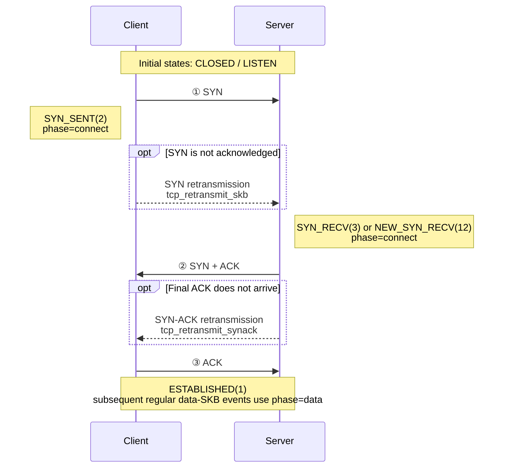

## Overview

`tcpshark --mode retransmit` observes TCP retransmission-related kernel activity
through the `tcp/tcp_retransmit_skb` and `tcp/tcp_retransmit_synack`
tracepoints. It can also observe the `tcp_send_loss_probe` kprobe when TLP
collection is explicitly enabled. Depending on the event type, an event can include the IP 4-tuple, TCP state,
congestion-control state, retransmission counters, sequence information, and
socket metadata used for container resolution.

The userspace classifier derives a connection phase and a reason label from
the event type, `sk_state`, `ca_state`, and reorder counters. These labels are
operational heuristics, not packet-loss root-cause proof.

Filter expressions are compiled at load time by `internal/pcapfilter` and run
in the kernel. Filters apply only to events that have an SKB
(`tcp_retransmit_skb`); SYN-ACK and TLP events bypass the pcap filter.

---

## 1. Filter Expressions

### 1.1 Supported Expressions

`internal/pcapfilter` uses the pure-Go go-pcap compiler and supports a subset
of tcpdump syntax. The following expressions are useful for tcpshark:

**Host**

```
host 10.0.0.1
src host 10.0.0.1
dst host 10.0.0.1
```

**Port**

```
port 443
src port 443
dst port 8080
```

**Network (CIDR)**

```
net 10.0.0.0/8
src net 192.168.1.0/24
dst net 172.16.0.0/12
```

**Boolean operators and grouping**

```
tcp and port 443
host 10.0.0.1 and (port 80 or port 443)
tcp and not net 169.254.0.0/16
```

All retransmission SKBs are TCP, so adding the `tcp` primitive is optional but
can make an expression easier to read.

### 1.2 Limitations

| Expression or event | Behavior |
|---------------------|----------|
| `tcp[tcpflags]`, `ip[8]`, `tcp[0:4]` | Byte-offset expressions are not supported by the current compiler. |
| Bare `ip` or `ip6` | Do not rely on these expressions to distinguish the address family in an L3 view; use `host`, `net`, or a more specific TCP expression. |
| `arp`, `ether host ...`, and other L2-only expressions | Not useful for TCP retransmission SKBs and may reject all L3 events or produce undefined L3 matches. |
| `tcp_retransmit_synack` or `tcp_send_loss_probe` | No SKB is available to the BPF program, so `--filter` is not applied. |

For complete syntax, limitations, and examples, refer to the [dropwatch documentation](/docs/best-practice/dropwatch_en.md). The event-coverage limitation above is specific to tcpshark.

### 1.3 Recommended Expressions

```bash
# Regular retransmitted SKBs to destination port 443
--filter "dst port 443"

# Regular retransmitted SKBs for one host in either direction
--filter "host 10.0.0.1"

# Regular retransmitted SKBs for a service subnet
--filter "dst net 10.20.0.0/16 and dst port 8443"

# Exclude a noisy endpoint from regular retransmitted-SKB events
--filter "tcp and not host 169.254.169.254"
```

> `--filter` does not make the entire output stream match the expression:
> `tcp_retransmit_synack` and enabled `tcp_send_loss_probe` events are still
> emitted. For standalone JSON output,
> use `jq` when all event types must be filtered by their formatted address and
> port fields.

---

## 2. Running tcpshark

```
tcpshark --mode retransmit [flags]
```

| Flag | Default | Description |
|------|---------|-------------|
| `--mode retransmit` | required | Select TCP retransmission tracing mode. |
| `--enable-tlp`, `--tlp` | disabled | Also attach `tcp_send_loss_probe` and emit TLP events. |
| `--bpf-path <path>` | required | Path to the `tcp_retransmit.o` eBPF object file. |
| `--filter <expr>` | (none) | tcpdump-style filter for `tcp_retransmit_skb` events; see §1. |
| `--duration <n>` | 0 | Stop after N seconds (0 = run until Ctrl-C). |
| `--max-events-per-second <n>` | 0 | BPF-side event rate limit; 0 means unlimited. |
| `--output <json\|text>` | `text` | Output format; ignored when `--output-storage` is set. |
| `--output-storage <path>` | (none) | Send events to huatuo-bamai over a Unix socket. |
| `--task-id <id>` | (none) | Task ID associated with the toolstream session; effective with `--output-storage`. |

When both `--output` and `--output-storage` are explicitly specified,
`--output` is ignored and a warning is printed.

### Quick examples

```bash
# Text output for all retransmission-related events
sudo tcpshark --mode retransmit --bpf-path bpf/tcp_retransmit.o

# NDJSON output
sudo tcpshark --mode retransmit --bpf-path bpf/tcp_retransmit.o --output json

# BPF-side filter for regular retransmitted SKBs to port 443
sudo tcpshark --mode retransmit --bpf-path bpf/tcp_retransmit.o --filter "dst port 443"

# Include Tail Loss Probe events (disabled by default)
sudo tcpshark --mode retransmit --enable-tlp --bpf-path bpf/tcp_retransmit.o

# Emit at most 100 events/second; overflow prints a rate limit hit log
sudo tcpshark --mode retransmit --bpf-path bpf/tcp_retransmit.o \
  --max-events-per-second 100

# Filter all formatted event types to destination port 443 in userspace
sudo tcpshark --mode retransmit --bpf-path bpf/tcp_retransmit.o --output json \
  | jq -c 'select(.dport == 443)'

# Keep only events classified as RTO for 60 seconds
sudo tcpshark --mode retransmit --bpf-path bpf/tcp_retransmit.o --duration 60 --output json \
  | jq -c 'select(.tcp_reason == "RTO")'

# Forward events to a running huatuo-bamai instance
sudo tcpshark --mode retransmit --bpf-path bpf/tcp_retransmit.o \
  --output-storage /var/run/huatuo-toolstream.sock
```

`jq -c` emits compact single-line JSON, which is convenient for NDJSON files
and downstream pipelines.

---

## 3. Event Payload

Each event is an NDJSON object (`types.TCPRetransTracing`). Fields tagged with
`omitempty` are absent when their value is empty or zero.

| Field | Type | Description |
|-------|------|-------------|
| `observed_timestamp` | string | UTC userspace receive/format time (RFC3339Nano), not the kernel hook timestamp. |
| `comm` | string | Current kernel execution-context command, not necessarily the socket-owning process. |
| `pid` | uint64 | Current execution-context TGID, not necessarily the socket owner's TGID. |
| `container_id` | string | Container ID when resolved by huatuo-bamai; see §6. |
| `memcg_css` | uint64 | Socket memory-cgroup CSS address used for container resolution. |
| `net_namespace_cookie` | uint64 | Socket network-namespace cookie used for container resolution. |
| `net_namespace_inum` | uint32 | Socket network namespace inum used for container resolution. |
| `tcp_saddr` | string | Source IP address. |
| `tcp_daddr` | string | Destination IP address. |
| `tcp_sport` | uint16 | Source port. |
| `tcp_dport` | uint16 | Destination port. |
| `tcp_state` | string | TCP socket state, such as `ESTABLISHED`, `SYN_SENT`, or `NEW_SYN_RECV`. |
| `phase` | string | Classifier output: `connect`, `data`, or `close`. |
| `tcp_reason` | string | Classifier output: `RTO`, `fast_retransmit`, `reorder_prone_fast`, `TLP`, or `unknown`. |
| `event_type` | string | `tcp_retransmit_skb`, `tcp_retransmit_synack`, or `tcp_send_loss_probe`. |
| `ca_state` | uint8 | Congestion-control state: 0=Open, 1=Disorder, 2=CWR, 3=Recovery, 4=Loss. |
| `icsk_retransmits` | uint8 | Current retransmission counter snapshot. |
| `icsk_pending` | uint8 | Raw pending timer state from `inet_connection_sock`; see the value table below. |
| `reord_seen` | uint32 | Cumulative flow reorder counter. |
| `dsack_dups` | uint32 | Cumulative DSACK duplicate counter. |
| `tcp_seq` | uint32 | `TCP_SKB_CB(skb)->seq` for SKB events, the retransmitted segment start sequence; zero for SYN-ACK events. |
| `tcp_ack_seq` | uint32 | `tcp_sk(sk)->rcv_nxt` for SKB events, the ACK sequence that the real retransmitted packet header will carry; zero for SYN-ACK events. |
| `tcp_end_seq` | uint32 | `TCP_SKB_CB(skb)->end_seq` for SKB events, the retransmitted segment end sequence; omitted for SYN-ACK events. |
| `tcp_flags` | string | Rendered TCP flag set such as `SYN|ACK` or `ACK|PSH`; SKB events use `TCP_SKB_CB(skb)->tcp_flags`, and SYN-ACK events derive it from the event type. |
| `skb_addr` | string | Retransmission-queue SKB pointer in hex; absent for SYN-ACK events. |
| `drop_location` | string | huatuo-bamai correlation heuristic; see §7. |
| `source` | string | Event source. It is `tools` when tcpshark runs standalone and `events` when huatuo-bamai launches it. |

`icsk_pending` is a timer-state snapshot at the hook, not a stable retransmission-reason enum. TLP classification uses the explicit `event_type=tcp_send_loss_probe` and does not depend on `icsk_pending=5`.

| Value | Kernel state | Meaning |
|------:|--------------|---------|
| `0` | None | No transmit-timer event is currently pending. |
| `1` | `ICSK_TIME_RETRANS` | Retransmission timeout timer (RTO). |
| `2` | `ICSK_TIME_DACK` | Delayed ACK; modern kernels keep this state in `icsk_ack.pending` and use a separate delayed-ACK timer, so it normally does not appear in `icsk_pending`. |
| `3` | `ICSK_TIME_PROBE0` | Zero-window probe timer. |
| `4` | Version-dependent | Current mainline kernels no longer define this value; older kernels used it for Early Retransmit, and still older kernels used it for Keepalive. |
| `5` | `ICSK_TIME_LOSS_PROBE` | Tail Loss Probe (TLP) timer. |
| `6` | `ICSK_TIME_REO_TIMEOUT` | Reordering timeout, primarily used by RACK loss detection. |

### Text output format

Text retains its terminal-friendly layout while covering the same event
variables as JSON. Variables tagged with `omitempty` appear only when non-zero
or non-empty, and string values are not JSON-quoted or escaped. For compatibility
with the original text format, `state`, `skb`, `seq`, `end`, `ack`, `flags`,
`ca`, and `retrans` correspond to the JSON fields `tcp_state`, `skb_addr`,
`tcp_seq`, `tcp_end_seq`, `tcp_ack_seq`, `tcp_flags`, `ca_state`, and
`icsk_retransmits`, respectively.

```
<timestamp> [<phase>/<tcp_reason>] <saddr>:<sport> > <daddr>:<dport> state=<STATE> event_type=<TYPE> [SYNACK] [skb=<ADDR>] seq=<N> [end=<N>] ack=<N> [flags=<FLAGS>] pid=<N> comm=<COMM> ca=<N> retrans=<N> icsk_pending=<N> [reord_seen=<N>] [dsack_dups=<N>] [container_id=<ID>] [memcg_css=<N>] [net_namespace_cookie=<N>] [net_namespace_inum=<N>] [drop_location=<LOCATION>] [source=<SOURCE>]
```

Example:

```
2026-07-23T02:14:40.304775546Z [data/RTO] 127.0.0.1:19996 > 127.0.0.1:42128 state=ESTABLISHED event_type=tcp_retransmit_skb skb=0xffff931c14fdf800 seq=3154974646 end=3154991030 ack=948393597 flags=ACK|PSH pid=1420 comm=kube-apiserver ca=4 retrans=4 icsk_pending=0 net_namespace_inum=4026531992
```

The `pid` and `comm` in this example describe the execution context in which
the hook ran; use `container_id` and socket metadata for workload attribution.

---

## 4. Kernel Events and Classification

### 4.1 Kernel Hook Points

| Hook | Kernel location | What the event means | Data availability |
|------|-----------------|----------------------|-------------------|
| tracepoint `tcp/tcp_retransmit_skb` | `__tcp_retransmit_skb()` | A retransmission was attempted for a retransmission-queue SKB. The tcpshark event does not retain the kernel transmit result. The SKB is headerless, so sequence fields come from `TCP_SKB_CB(skb)` and ACK comes from `tcp_sk(sk)->rcv_nxt`. | SKB pointer, TCP seq/end_seq/ack/flags, socket state, CA state, timers, and reorder counters. |
| tracepoint `tcp/tcp_retransmit_synack` | `tcp_rtx_synack()` | A passive-open SYN-ACK retransmission was successfully submitted by `tcp_rtx_synack()`. | Request-socket addresses and ports; no retransmission SKB pointer or TCP seq/ack. |
| kprobe `tcp_send_loss_probe` | `tcp_send_loss_probe()` | A Tail Loss Probe is being prepared; collected only with `--enable-tlp`. | Socket metadata plus `snd_nxt`/`snd_una`; no SKB pointer or rendered TCP flags. |

The BPF program uses CO-RE field reads (`BPF_CORE_READ` and related helpers),
so supported kernel layouts do not require rebuilding the C source for each
kernel version.

### 4.2 Connection Phase

The regular-SKB phase is derived from `sk_state`. SYN-ACK events use a fixed
phase in userspace.

The TCP three-way handshake below shows the `connect` phase and its
retransmission hook points:



The three solid arrows are the initial handshake packets and do not produce
tcpshark events. Only the retransmission paths inside the optional blocks are
observed. Active-open SYN retries are reported by `tcp_retransmit_skb`, while
passive-open SYN-ACK retries are reported by `tcp_retransmit_synack`; both are
classified as `connect`.

The complete phase mapping is:

| Phase | Source state or event | Description |
|-------|-----------------------|-------------|
| `connect` | SYN_SENT(2), SYN_RECV(3), NEW_SYN_RECV(12), or `tcp_retransmit_synack` | Connection establishment. |
| `data` | ESTABLISHED(1) or unrecognized/default states | Data transfer/default classification. |
| `close` | FIN_WAIT1(4), FIN_WAIT2(5), TIME_WAIT(6), CLOSE_WAIT(8), LAST_ACK(9), CLOSING(11) | Connection teardown. |

### 4.3 Reason Classification

| Event or condition | Reason | Interpretation |
|--------------------|--------|----------------|
| `tcp_retransmit_synack` | `RTO` | Fixed userspace label for the SYN-ACK retry timer path. |
| `tcp_send_loss_probe` | `TLP` | Fixed userspace label for the optional Tail Loss Probe hook. |
| `tcp_retransmit_skb`, `ca_state=4` (Loss) | `RTO` | The socket is in TCP_CA_Loss. |
| `tcp_retransmit_skb`, `ca_state=3` (Recovery) | `fast_retransmit` or `reorder_prone_fast` | Recovery-path retransmission; the reorder-prone label is selected when cumulative reorder history exists. |
| `tcp_retransmit_skb`, `ca_state=0..2`, connect/close phase | `RTO` | Phase-based fallback used by the current classifier. |
| `tcp_retransmit_skb`, `ca_state=0..2`, data phase | `unknown` | The available snapshots are insufficient to assign another label. |

The classifier observes socket state at the hook and cannot reconstruct the
complete ACK/loss history. Treat `tcp_reason` as a grouping label rather than a
verified root cause.

### 4.4 Reorder Heuristic

The reorder-prone label is selected when either `reord_seen` or `dsack_dups` is
non-zero. Once a flow has reorder history, subsequent Recovery-state SKB events
can be labeled `reorder_prone_fast`. This is a flow-level heuristic, not proof
that the current retransmission was caused by reordering.

---

## 5. Integration with huatuo-bamai

### Subprocess mode (default)

huatuo-bamai launches `tcpshark` as a child process and passes
`--output-storage`, so events return through the built-in toolstream Unix
socket. stdout and stderr are drained as logs; huatuo-bamai does not parse
NDJSON from stdout in this mode. Typical arguments are:

```bash
tcpshark \
  --mode retransmit \
  --bpf-path <CoreBpfDir>/tcp_retransmit.o \
  --output-storage /var/run/huatuo-toolstream.sock \
  --max-events-per-second 100 \
  --filter "dst port 443"
```

The toolstream handler resolves container metadata, applies drop correlation,
and passes the event to the configured tracing storage backends through
`tracing.Save`.

### Direct event storage (`--output-storage`)

`tcpshark --mode retransmit --output-storage <socket-path>` sends events to a running
huatuo-bamai instance over a Unix domain socket using the toolstream protocol.
When `--output-storage` is set, `--output` is ignored. Container ID resolution
is described in §6 and drop correlation in §7.

### Configuration reference (`huatuo-bamai.conf`)

```toml
[EventTracing.TCPRetransmit]
    # Forwarded to tcpshark --filter.
    # Applies only to tcp_retransmit_skb events; see §1.2.
    # Default: ""
    Filter = ""

    # Forwarded as tcpshark --enable-tlp. Default: false.
    EnableTLP = false

    # Forwarded as tcpshark --max-events-per-second. Default: 100; 0 disables it.
    MaxEventsPerSecond = 100
```

The `tcp_retransmit` tracer is in the global `BlackList` by default. Remove it
from the list and restart huatuo-bamai to enable the tracer. Its
drop-correlation cache is enabled only while the tracer is running and is
cleared when the tracer stops.

After `tcp_retransmit` is no longer blacklisted, start or stop it through the HTTP
API:

```bash
curl -X PUT http://localhost:19704/tracers/tcp_retransmit/start
curl -X PUT http://localhost:19704/tracers/tcp_retransmit/stop
```

---

## 6. Container ID Resolution

`tcpshark` itself has no access to the Pod manager. Container ID is resolved
by huatuo-bamai:

| Mode | Behavior |
|------|----------|
| Standalone stdout output | `container_id` is normally absent. Socket memcg/netns metadata is still emitted when available. |
| huatuo-bamai / `--output-storage` | When `container_id` is empty, huatuo-bamai tries `memcg_css`, then `net_namespace_cookie`, then `net_namespace_inum`. |

If all lookups miss, `container_id` remains empty and the event is still
stored. `pid`/`comm` should not be used as a fallback for socket ownership
because they describe the hook execution context.

---

## 7. Drop Correlation Heuristic (`drop_location`)

When dropwatch and tcpshark feed the same huatuo-bamai process, dropwatch
events are retained in a userspace cache for two seconds from their arrival
time. A tcpshark event immediately queries previously received, unexpired
drop events using a direction-independent connection key. The implementation
does not wait for later drop events and does not revise an event after storage.

### 7.1 Correlation Results

| Internal result | Match | `drop_location` | Safe interpretation |
|-----------------|-------|-----------------|---------------------|
| `RetransDropDirect` | Both events have the same non-empty `skb_addr`. | `host_software` | Strong evidence that the observed host drop and retransmission refer to the same SKB pointer. |
| `RetransDrop5Tuple` | A cached TCP drop matches the addresses and ports in either direction. | `host_software` | A host drop was observed on the same connection near the retransmission; causality is not proven. |
| `RetransNoDrop` | No matching live cache entry exists. | `network_or_host_hardware` | Current fallback label only; it does not prove a network or hardware drop. |

`network_or_host_hardware` can also be produced when dropwatch is disabled,
its filter does not cover the flow, an event is suppressed or lost, delivery
is reordered, or the relevant drop falls outside the retention window.
Likewise, a 4-tuple match can pair unrelated packets from a busy connection.
The cache key does not include a network-namespace or container identifier, so
identical address/port tuples in different network namespaces can also collide.

### 7.2 Requirements and Troubleshooting

| Observation | Checks |
|-------------|--------|
| `host_software` with a direct match | Inspect the matching dropwatch stack, device, and drop metadata. |
| `host_software` from a connection match | Verify direction, TCP sequence/ack context, and timing before assigning causality. |
| `network_or_host_hardware` | First confirm dropwatch is running in the same huatuo-bamai process and its filter covers the flow; then inspect NIC and network counters. |
| `drop_location` absent | Expected in standalone output; correlation is performed by huatuo-bamai, not the CLI. |

For reliable negative evidence, dropwatch must be active with a filter that is
at least as broad as the tcpshark traffic of interest. The current schema has
no separate `unknown` or `dropwatch_not_observed` value, so consumers should
treat `network_or_host_hardware` as an investigation hint rather than a fact.

---

## 8. Operational Guidance and Noise Suppression

No event type is unconditionally safe to discard. Prefer rate, ratio, and
service-impact thresholds over filtering solely by `event_type` or `tcp_reason`.

| Pattern | Typical priority | Guidance |
|---------|------------------|----------|
| `tcp_reason=RTO` | High | Investigate sustained or service-correlated increases; RTO normally has greater latency impact than Recovery-path retransmission. |
| `tcp_reason=fast_retransmit` | Medium | Correlate with loss, congestion, and SACK/RACK behavior. |
| `tcp_reason=reorder_prone_fast` | Context dependent | The flow has prior reorder history, but the current event is not proven spurious; inspect latency and counter growth. |
| `tcp_reason=TLP` | Context dependent | Optional signal only; confirm that TLP collection was deliberately enabled before using it in alerting. |
| `event_type=tcp_retransmit_synack` | Usually low per isolated retry | Repeated events can indicate handshake reachability, host egress, firewall, or client/network problems. |

When building alerts, aggregate by service/connection and compare against
traffic volume. A small absolute count on a busy host can be benign, while a
burst affecting a low-volume critical service can be significant.
