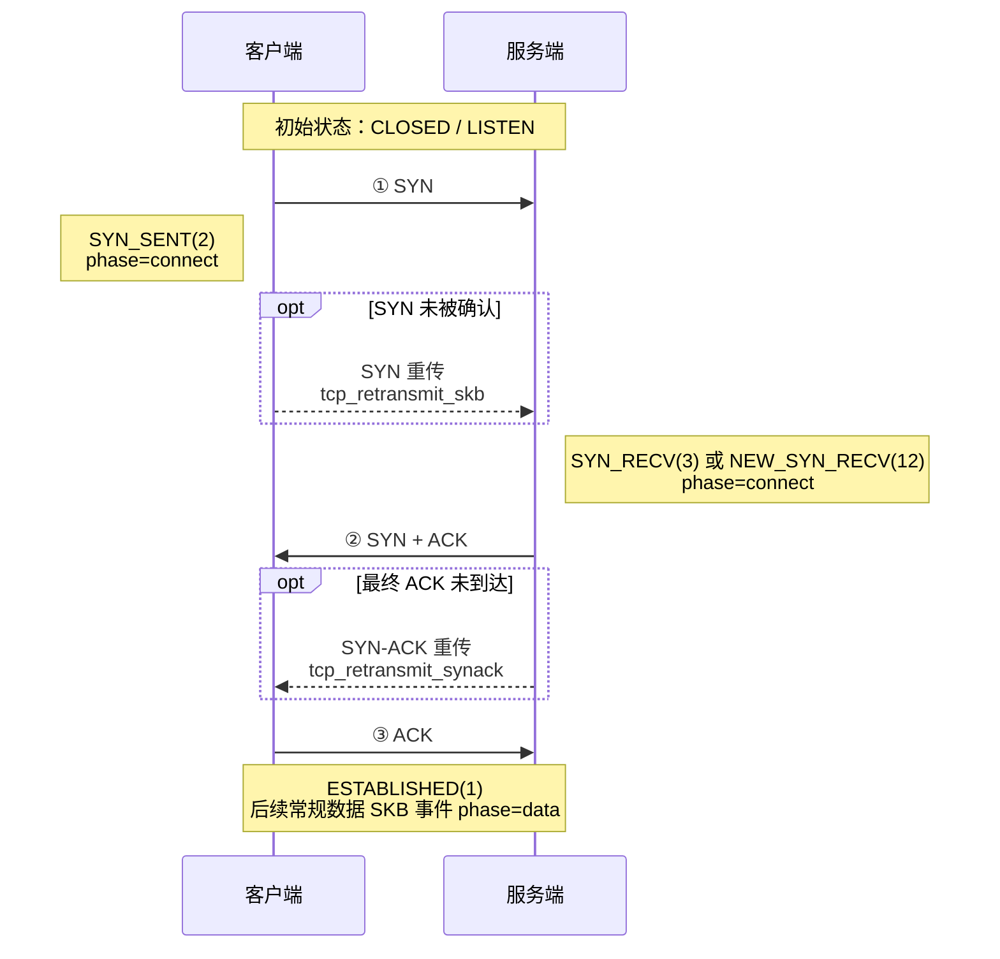

{}
<div style="text-align: left;">
HUATUO（华佗）是由滴滴开源并依托 CCF（中国计算机学会）孵化的操作系统深度观测项目，广泛应用于AI 计算、AI 沙箱、云原生通用计算、云服务、基础架构服务等场景。
</div>
{}

## 概述

`tcpshark --mode retransmit` 通过内核跟踪点 `tcp/tcp_retransmit_skb` 和 `tcp/tcp_retransmit_synack` 观测 TCP 重传相关活动。显式开启 TLP 后，还会观测 `tcp_send_loss_probe` kprobe。根据事件类型，每条事件可携带 IP 四元组、TCP 状态、拥塞控制状态、重传计数器、序列号信息，以及用于解析容器归属的 socket 元数据。

用户态分类器根据事件类型、`sk_state`、`ca_state` 和乱序计数器生成连接阶段与原因标签。这些标签是用于运维分析的启发式分类，不是丢包根因的确定性证据。

过滤表达式由 `internal/pcapfilter` 在加载时编译并在内核中执行。过滤器只对携带 SKB 的 `tcp_retransmit_skb` 事件生效；SYN-ACK 和 TLP 事件会绕过 pcap 过滤器。

---

## 🎯 场景

### 1. TCP 网络质量与重传诊断

通过持续观测 RTO、快速重传、乱序倾向重传和 TLP 事件，识别连接建立、数据传输及连接关闭阶段的异常重传，辅助判断网络丢包、拥塞、乱序或对端不可达等问题。

### 2. Kubernetes 容器网络故障排查

结合容器 ID、网络命名空间和 socket cgroup 元数据定位发生重传的工作负载，并使用 `--filter "tcp and port <service-port>"` 聚焦特定服务流量，减少宿主机上其他连接的干扰。

### 3. 应用延迟与吞吐毛刺分析

将 TCP 重传事件与应用延迟、错误率和吞吐曲线对齐，分析 RTO 或连续重传是否与服务性能下降同时发生，辅助区分应用处理变慢与底层网络异常。

### 4. 与 dropwatch 关联定位丢包位置

在同一 huatuo-bamai 进程中同时运行 dropwatch 和 tcp_retransmit，通过 SKB 指针或连接五元组关联丢包与重传事件，辅助判断问题更可能发生在主机协议栈还是外部网络；关联结果属于启发式证据，仍需结合调用栈和网络指标确认。

---

## 1. 过滤表达式

`tcpshark --filter` 与 dropwatch 使用相同的 tcpdump 风格过滤表达式。支持的语法、限制和示例请参考 [dropwatch 文档](https://docs.huatuo.tech/en/latest/best-practice/dropwatch/)。

> `--filter` 不能保证整个输出流都满足表达式：`tcp_retransmit_synack` 和已开启的 `tcp_send_loss_probe` 事件仍会输出。如果独立工具的 JSON 输出需要过滤全部事件类型，应使用 `jq` 按格式化后的地址和端口字段过滤。

---

## 2. 运行 tcpshark

```
tcpshark --mode retransmit [flags]
```

| 参数 | 默认值 | 说明 |
|------|--------|------|
| `--mode retransmit` | 必填 | 选择 TCP 重传追踪模式。 |
| `--enable-tlp`、`--tlp` | 关闭 | 同时挂载 `tcp_send_loss_probe` 并输出 TLP 事件。 |
| `--bpf-path <path>` | 必填 | `tcp_retransmit.o` eBPF 对象文件路径。 |
| `--filter <expr>` | （无） | 仅用于 `tcp_retransmit_skb` 事件的 tcpdump 风格过滤器，见 §1。 |
| `--duration <n>` | 0 | 运行 N 秒后退出（0 表示持续运行直至 Ctrl-C）。 |
| `--max-events-per-second <n>` | 0 | BPF 侧事件限速，0 表示不限速。 |
| `--output <json\|text>` | `text` | 输出格式；设置 `--output-storage` 时会被忽略。 |
| `--output-storage <path>` | （无） | 通过 Unix socket 将事件发送给 huatuo-bamai。 |
| `--task-id <id>` | （无） | toolstream 会话关联的任务 ID；与 `--output-storage` 一起使用时生效。 |

显式同时指定 `--output` 和 `--output-storage` 时，`--output` 会被忽略并打印警告。

### 常用命令

```bash
# 文本格式输出全部重传相关事件
sudo tcpshark --mode retransmit --bpf-path bpf/tcp_retransmit.o

# NDJSON 格式输出
sudo tcpshark --mode retransmit --bpf-path bpf/tcp_retransmit.o --output json

# 在 BPF 侧过滤目标端口为 443 的常规重传 SKB
sudo tcpshark --mode retransmit --bpf-path bpf/tcp_retransmit.o --filter "dst port 443"

# 包含 Tail Loss Probe 事件（默认关闭）
sudo tcpshark --mode retransmit --enable-tlp --bpf-path bpf/tcp_retransmit.o

# 最多输出 100 条事件/秒；超限时打印 rate limit hit 日志
sudo tcpshark --mode retransmit --bpf-path bpf/tcp_retransmit.o \
  --max-events-per-second 100

# 在用户态过滤全部格式化事件类型，只保留目标端口 443
sudo tcpshark --mode retransmit --bpf-path bpf/tcp_retransmit.o --output json \
  | jq -c 'select(.dport == 443)'

# 运行 60 秒，仅保留分类为 RTO 的事件
sudo tcpshark --mode retransmit --bpf-path bpf/tcp_retransmit.o --duration 60 --output json \
  | jq -c 'select(.tcp_reason == "RTO")'

# 将事件转发给正在运行的 huatuo-bamai 实例
sudo tcpshark --mode retransmit --bpf-path bpf/tcp_retransmit.o \
  --output-storage /var/run/huatuo-toolstream.sock
```

`jq -c` 将每条结果压缩成单行 JSON，便于保存为 NDJSON 或继续通过管道处理。

---

## 3. 事件数据结构

每条事件以 NDJSON 对象（`types.TCPRetransTracing`）表示。带 `omitempty` 标签的字段在值为空或零时不会输出。

| 字段 | 类型 | 说明 |
|------|------|------|
| `observed_timestamp` | string | 用户态接收/格式化事件时生成的 UTC 时间（RFC3339Nano），不是内核 hook 时间。 |
| `comm` | string | 当前内核执行上下文的进程名，不一定是 socket 所属进程。 |
| `pid` | uint64 | 当前执行上下文的 TGID，不一定是 socket 所属进程的 TGID。 |
| `container_id` | string | huatuo-bamai 解析出的容器 ID，见 §6。 |
| `memcg_css` | uint64 | 用于解析容器归属的 socket 内存 cgroup CSS 地址。 |
| `net_namespace_cookie` | uint64 | 用于解析容器归属的 socket 网络命名空间 cookie。 |
| `net_namespace_inode` | uint32 | 用于解析容器归属的 socket 网络命名空间 inode。 |
| `saddr` | string | 源 IP 地址。 |
| `daddr` | string | 目的 IP 地址。 |
| `sport` | uint16 | 源端口。 |
| `dport` | uint16 | 目的端口。 |
| `tcp_state` | string | TCP socket 状态，如 `ESTABLISHED`、`SYN_SENT` 或 `NEW_SYN_RECV`。 |
| `phase` | string | 分类结果：`connect`、`data` 或 `close`。 |
| `tcp_reason` | string | 分类结果：`RTO`、`fast_retransmit`、`reorder_prone_fast`、`TLP` 或 `unknown`。 |
| `event_type` | string | `tcp_retransmit_skb`、`tcp_retransmit_synack` 或 `tcp_send_loss_probe`。 |
| `ca_state` | uint8 | 拥塞控制状态：0=Open、1=Disorder、2=CWR、3=Recovery、4=Loss。 |
| `icsk_retransmits` | uint8 | 当前重传计数器快照。 |
| `icsk_pending` | uint8 | `inet_connection_sock` 中原始的待处理定时器状态。 |
| `reord_seen` | uint32 | 连接累计乱序计数器。 |
| `dsack_dups` | uint32 | 累计 DSACK 重复计数器。 |
| `tcp_seq` | uint32 | SKB 事件中 `TCP_SKB_CB(skb)->seq`，即重传段起始序列号；SYN-ACK 事件中为零。 |
| `tcp_ack` | uint32 | SKB 事件中 `tcp_sk(sk)->rcv_nxt`，即实际重传包 TCP 头会携带的 ACK 序号；SYN-ACK 事件中为零。 |
| `tcp_end_seq` | uint32 | SKB 事件中 `TCP_SKB_CB(skb)->end_seq`，即重传段结束序列号；SYN-ACK 事件中省略。 |
| `tcp_flags` | string | 渲染后的 TCP flag 集合，如 `SYN|ACK`、`ACK|PSH`；SKB 事件来自 `TCP_SKB_CB(skb)->tcp_flags`，SYN-ACK 事件由事件类型派生。 |
| `skb_addr` | string | 十六进制重传队列 SKB 指针；SYN-ACK 事件中不存在。 |
| `drop_location` | string | huatuo-bamai 生成的丢包关联启发式结果，见 §7。 |
| `source` | string | 可选来源字段；存在时标识 `events` 或 `tools`。独立 CLI 当前不设置该字段。 |

### 文本输出格式

文本输出保留面向终端的可读布局，同时覆盖与 JSON 相同的事件变量。带 `omitempty` 的变量仅在非零或非空时显示，字符串值不添加 JSON 引号或转义。为兼容原文本格式，`state`、`skb`、`seq`、`end`、`ack`、`flags`、`ca` 和 `retrans` 分别对应 JSON 中的 `tcp_state`、`skb_addr`、`tcp_seq`、`tcp_end_seq`、`tcp_ack`、`tcp_flags`、`ca_state` 和 `icsk_retransmits`。

```
<timestamp> [<phase>/<tcp_reason>] <saddr>:<sport> > <daddr>:<dport> state=<STATE> event_type=<TYPE> [SYNACK] [skb=<ADDR>] seq=<N> [end=<N>] ack=<N> [flags=<FLAGS>] pid=<N> comm=<COMM> ca=<N> retrans=<N> icsk_pending=<N> [reord_seen=<N>] [dsack_dups=<N>] [container_id=<ID>] [memcg_css=<N>] [net_namespace_cookie=<N>] [net_namespace_inode=<N>] [drop_location=<LOCATION>] [source=<SOURCE>]
```

示例：

```
2026-07-23T02:14:40.304775546Z [data/RTO] 127.0.0.1:19996 > 127.0.0.1:42128 state=ESTABLISHED event_type=tcp_retransmit_skb skb=0xffff931c14fdf800 seq=3154974646 end=3154991030 ack=948393597 flags=ACK|PSH pid=1420 comm=kube-apiserver ca=4 retrans=4 icsk_pending=0 net_namespace_inode=4026531992
```

示例中的 `pid` 和 `comm` 表示 hook 运行时的执行上下文；工作负载归属应使用 `container_id` 和 socket 元数据判断。

---

## 4. 内核事件与分类

### 4.1 内核挂载点

| 挂载点 | 内核位置 | 事件含义 | 可用数据 |
|--------|----------|----------|----------|
| tracepoint `tcp/tcp_retransmit_skb` | `__tcp_retransmit_skb()` | 对一个重传队列 SKB 发起了重传尝试；tcpshark 事件不保留内核发送结果。该 SKB 是 headerless 的，因此序列号来自 `TCP_SKB_CB(skb)`，ACK 来自 `tcp_sk(sk)->rcv_nxt`。 | SKB 指针、TCP seq/end_seq/ack/flags、socket 状态、CA 状态、定时器和乱序计数器。 |
| tracepoint `tcp/tcp_retransmit_synack` | `tcp_rtx_synack()` | `tcp_rtx_synack()` 成功提交了一次被动建连 SYN-ACK 重传。 | request socket 地址和端口；没有重传 SKB 指针及 TCP seq/ack。 |
| kprobe `tcp_send_loss_probe` | `tcp_send_loss_probe()` | 正在准备 Tail Loss Probe；仅在指定 `--enable-tlp` 时采集。 | socket 元数据及 `snd_nxt`/`snd_una`；没有 SKB 指针或渲染后的 TCP flags。 |

BPF 程序通过 `BPF_CORE_READ` 等辅助方法执行 CO-RE 字段读取，因此在支持的内核布局上无需为每个内核版本重新编译 C 源码。

### 4.2 连接阶段

常规 SKB 事件的阶段由 `sk_state` 决定；SYN-ACK 事件在用户态使用固定阶段。

下面以 TCP 三次握手说明 `connect` 阶段及对应的重传观测点：



图中的三条实线表示首次握手报文，不会产生 tcpshark 事件；只有可选框中的重传路径会被观测。主动端 SYN 重传通过 `tcp_retransmit_skb` 上报，被动端 SYN-ACK 重传通过 `tcp_retransmit_synack` 上报，两者都归类为 `connect`。

完整阶段映射如下：

| 阶段 | 来源状态或事件 | 说明 |
|------|----------------|------|
| `connect` | SYN_SENT(2)、SYN_RECV(3)、NEW_SYN_RECV(12) 或 `tcp_retransmit_synack` | 连接建立。 |
| `data` | ESTABLISHED(1) 或无法识别/默认状态 | 数据传输或默认分类。 |
| `close` | FIN_WAIT1(4)、FIN_WAIT2(5)、TIME_WAIT(6)、CLOSE_WAIT(8)、LAST_ACK(9)、CLOSING(11) | 连接关闭。 |

### 4.3 原因分类

| 事件或条件 | 原因 | 含义 |
|------------|------|------|
| `tcp_retransmit_synack` | `RTO` | SYN-ACK 重试定时器路径的固定用户态标签。 |
| `tcp_send_loss_probe` | `TLP` | 可选 Tail Loss Probe hook 的固定用户态标签。 |
| `tcp_retransmit_skb`，`ca_state=4`（Loss） | `RTO` | socket 当前处于 TCP_CA_Loss。 |
| `tcp_retransmit_skb`，`ca_state=3`（Recovery） | `fast_retransmit` 或 `reorder_prone_fast` | Recovery 路径重传；存在累计乱序历史时使用 reorder-prone 标签。 |
| `tcp_retransmit_skb`，`ca_state=0..2`，connect/close 阶段 | `RTO` | 当前分类器使用的阶段回退结果。 |
| `tcp_retransmit_skb`，`ca_state=0..2`，data 阶段 | `unknown` | 当前快照不足以生成其他标签。 |

分类器只观察 hook 时刻的 socket 状态，无法重建完整的 ACK/丢包历史。因此应把 `tcp_reason` 视为聚合标签，而不是经过验证的根因。

### 4.4 乱序启发式判断

当 `reord_seen` 或 `dsack_dups` 任一累计计数器非零时，分类器会选择乱序倾向标签。连接一旦出现过乱序历史，后续 Recovery 状态的 SKB 事件就可能标记为 `reorder_prone_fast`。这是连接级启发式判断，不能证明当前重传由乱序触发。

---

## 5. 与 huatuo-bamai 集成

### 子进程模式（默认）

huatuo-bamai 以子进程形式启动 `tcpshark` 并传入 `--output-storage`，事件通过内置 toolstream Unix socket 返回。该模式下 stdout 和 stderr 仅作为日志读取，huatuo-bamai 不会从 stdout 解析 NDJSON。典型参数如下：

```bash
tcpshark \
  --mode retransmit \
  --bpf-path <CoreBpfDir>/tcp_retransmit.o \
  --output-storage /var/run/huatuo-toolstream.sock \
  --max-events-per-second 100 \
  --filter "dst port 443"
```

toolstream handler 负责解析容器元数据、执行丢包关联，再通过 `tracing.Save` 将事件交给已配置的 tracing 存储后端。

### 直连事件存储（`--output-storage`）

`tcpshark --mode retransmit --output-storage <socket-path>` 通过 Unix 域套接字和 toolstream 协议把事件发送给正在运行的 huatuo-bamai 实例。设置 `--output-storage` 后，`--output` 会被忽略。容器 ID 解析见 §6，丢包关联见 §7。

### 配置项参考（`huatuo-bamai.conf`）

```toml
[EventTracing.TCPRetransmit]
    # Forwarded to tcpshark --filter.
    # 仅过滤 tcp_retransmit_skb 事件，见第 1 节。
    # Default: ""
    Filter = ""

    # 设置为 true 时传入 tcpshark --enable-tlp；默认 false。
    EnableTLP = false

    # 传给 tcpshark --max-events-per-second；默认 100，0 表示不限速。
    MaxEventsPerSecond = 100
```

`tcp_retransmit` tracer 默认位于全局 `BlackList` 中。需要启用时，从名单中移除 `tcp_retransmit` 并重启 huatuo-bamai。丢包关联缓存仅在 tracer 运行期间启用，tracer 停止时会关闭并清空。

`tcp_retransmit` 不在黑名单后，可通过 HTTP API 启停 tracer：

```bash
curl -X PUT http://localhost:19704/tracers/tcp_retransmit/start
curl -X PUT http://localhost:19704/tracers/tcp_retransmit/stop
```

---

## 6. 容器 ID 解析

`tcpshark` 自身无法访问 Pod 管理器，容器 ID 由 huatuo-bamai 解析：

| 模式 | 行为 |
|------|------|
| 独立 stdout 输出 | `container_id` 通常不存在；可用时仍会输出 socket memcg/netns 元数据。 |
| huatuo-bamai / `--output-storage` | `container_id` 为空时，依次尝试 `memcg_css`、`net_namespace_cookie`、`net_namespace_inode`。 |

全部解析未命中时，`container_id` 保持为空，事件仍会存储。`pid`/`comm` 描述的是 hook 执行上下文，不应作为判断 socket 归属的回退依据。

---

## 7. 丢包关联启发式判断（`drop_location`）

dropwatch 和 tcpshark 向同一个 huatuo-bamai 进程发送事件时，dropwatch 事件会从到达用户态的时刻起在缓存中保留两秒。tcpshark 事件会立即按与方向无关的连接 key 查询此前已收到且尚未过期的 drop 事件。当前实现不会等待之后才到达的 drop 事件，也不会在事件存储后更新关联结果。

### 7.1 关联结果

| 内部结果 | 匹配条件 | `drop_location` | 安全解读方式 |
|----------|----------|-----------------|--------------|
| `RetransDropDirect` | 两条事件都有相同的非空 `skb_addr`。 | `host_software` | 有较强证据表明观测到的主机丢包与重传指向同一 SKB 指针。 |
| `RetransDrop5Tuple` | 缓存中的 TCP drop 与重传事件的地址和端口正向或反向匹配。 | `host_software` | 重传附近在同一连接上观测到了主机丢包，不能证明因果关系。 |
| `RetransNoDrop` | 没有匹配且仍有效的缓存项。 | `network_or_host_hardware` | 只是当前实现的回退标签，不能证明发生了网络或硬件丢包。 |

dropwatch 未启用、过滤器未覆盖该连接、事件被抑制或丢失、投递乱序、相关 drop 超出缓存保留窗口时，同样会得到 `network_or_host_hardware`。五元组匹配也可能把繁忙连接上的无关报文关联到一起。缓存 key 不包含网络命名空间或容器标识，因此不同网络命名空间中地址和端口完全相同的连接也可能发生串联。

### 7.2 使用条件与排查方式

| 观测结果 | 检查项 |
|----------|--------|
| `host_software` 且直接匹配 | 检查对应 dropwatch 事件的调用栈、设备和 drop 元数据。 |
| `host_software` 且仅连接匹配 | 在判断因果前核对方向、TCP seq/ack 上下文和时间关系。 |
| `network_or_host_hardware` | 先确认 dropwatch 与 tcpshark 位于同一 huatuo-bamai 进程且过滤器覆盖该连接，再检查网卡和网络计数器。 |
| `drop_location` 不存在 | 独立输出中的预期行为；关联由 huatuo-bamai 而不是 CLI 执行。 |

要让“未观测到主机丢包”具备较可靠的负向证据，dropwatch 必须处于运行状态，并且过滤范围至少覆盖待分析的 tcpshark 流量。当前 schema 没有单独的 `unknown` 或 `dropwatch_not_observed` 值，因此消费者应把 `network_or_host_hardware` 视为排查提示，而不是事实。

---

## 8. 运维解读与噪声过滤

没有任何事件类型可以无条件丢弃。相比只按 `event_type` 或 `tcp_reason` 过滤，更推荐按速率、比例和服务影响设置阈值。

| 模式 | 通常优先级 | 建议 |
|------|------------|------|
| `tcp_reason=RTO` | 高 | 排查持续增长或与服务异常相关的 RTO；它通常比 Recovery 路径重传带来更大延迟影响。 |
| `tcp_reason=fast_retransmit` | 中 | 结合丢包、拥塞及 SACK/RACK 行为分析。 |
| `tcp_reason=reorder_prone_fast` | 视上下文而定 | 连接存在乱序历史，但不能证明当前事件是伪重传；应检查延迟和计数器增长。 |
| `tcp_reason=TLP` | 视上下文而定 | 这是可选信号；用于告警前应确认已主动开启 TLP 采集。 |
| `event_type=tcp_retransmit_synack` | 单次通常较低 | 重复出现可能意味着握手可达性、主机出口、防火墙、客户端或网络问题。 |

配置告警时，应按服务/连接聚合并结合流量规模判断。繁忙主机上的少量绝对计数可能无害，而低流量关键服务上的突发事件可能具有较大影响。
